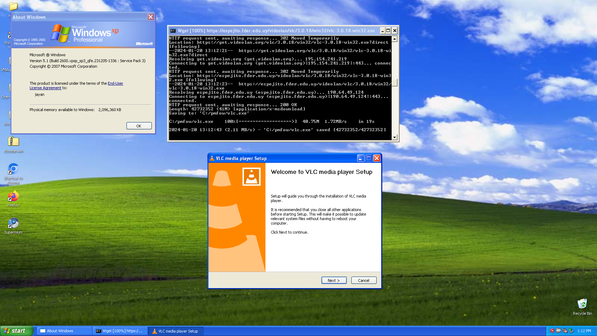

# Package Manager for Old Windows
   

## Languages
[English](https://github.com/MasterJayanX/pmfow/blob/main/README.md) | [Español](https://github.com/MasterJayanX/pmfow/blob/main/README_ES.md)
## Description
pmfow (Package Manager for Old Windows) is a program that allows you to install applications from the command line in older versions of Windows similarly to how you would do it in Linux or in Windows 10 with [winget](https://github.com/microsoft/winget-cli).

<figure>
  
 <figcaption>Screenshot of pmfow installing Legacy Update on a Windows XP VM.</figcaption>
</figure>
<figure>
 
 <figcaption>Screenshot of pmfow installing VLC Media Player on the same Windows XP VM.</figcaption>
</figure>

## Requirements
### Hardware requirements
pmfow will run on anything that runs Windows 2000 or later and has an internet connection.

**Minimum requirements**
- A CPU
- Some RAM
- At least 16 MB of storage available
- An internet connection

**Recommended requirements**
- A Pentium or better CPU.
- 512 MB of RAM (needed to run versions of Windows newer than XP) or enough RAM to use a web browser.
- At least 300 MB of storage available
- A good internet connection (good enough to download somewhat large files).

### Software requirements
pmfow will run in most versions of Windows from Windows 2000 onwards. Note: some versions of Windows might require you to download [this update](https://support.microsoft.com/en-us/topic/update-for-universal-c-runtime-in-windows-c0514201-7fe6-95a3-b0a5-287930f3560c).

**This is the list of fully supported versions:**

- Windows XP
- Windows Vista
- Windows 7
- Windows 8
- Windows 8.1
- All their server variants

**This is the list of partially supported versions:**

- Windows 10: Windows 10 is partially supported, as most of the packages on Windows 10's repository are the same packages as the ones for Windows 8/8.1. For Windows 10 and 11, use winget instead.
- Windows 11 for the same reason as Windows 10.
- Windows 2000: Limited selection of packages available for this version of Windows and you can only use it with an old version of wget, which may not work correctly.
- ReactOS: It will run, but certain applications that can be installed with pmfow will not work by default.

## Installation
To install pmfow, you need to follow these steps:
1. Download the .exe file from the [Releases](https://github.com/MasterJayanX/pmfow/releases) page that corresponds to the architecture of your CPU. If you are not sure which one you should pick, go to Control Panel > System and see if it says "32 bit Operating System" or "64 bit Operating System". If it says 32 bit, choose the version that says win32 and if it says 64 bit, choose the version that says win64.
2. Open the .exe file and install pmfow it on any directory you want (by default it will be installed in your Program Files folder). The installer will also add the directory to the system's PATH by default, allowing you to run pmfow from any directory.

## Usage
To use pmfow, open a CMD window and run the following command: `pmfow <command>` (Note: if you didn't follow step 3 of the installation, you will have to open the cmd window in the same folder you extracted the pmfow executable in and type `pmfow.exe <command>` instead).
Here's a list of commands you can use:
- `pmfow install <package>`: This command will allow you to install the program you want. Alternatively, you can use `pmfow i <package>`.
- `pmfow uninstall <package>`: This command will allow you to uninstall the program you want. Alternatively, you can use `pmfow remove <package>` or `pmfow rm <package>`.
- `pmfow update`: This will update the repositories, which are just .txt files, but still. Alternatively, you can use `pmfow u`.
- `pmfow search <package>`: This command will allow you to search for a specific package in the repositories of your operating system. Alternatively, you can use `pmfow s <package>`.
- `pmfow version`: This command will show you the version of pmfow that you are running, as well as your version of Windows. Alternatively, you can use `pmfow about` or `pmfow v`.
- `pmfow help`: This command will show you a list of commands with a description for each one, like the one you are seeing here. Alternatively, you can use `pmfow h`.
- `pmfow list`: This command lists all the available packages in your current repository. Alternatively, you can use `pmfow l`.

If you are using the install, uninstall, update, list or search commands, you can use these flags:
- `-c` or `--check-certificates`: Makes wget check for certificates when downloading a package.
- `-f <version>` or `--force-os <version>`: Forces pmfow to install packages for a different version of Windows.
- `--show-url`: Shows the URL from which the package you are installing or searching for is downloaded.
- `-o` or `--one-file`: The update command will only update the repository file that corresponds to your current version of Windows.
- `-w <version>` or `--wget-version <version>`: Forces the install or update command to use a version of wget for a specific version of Windows (for example: Windows XP) instead of renaming the file of the version you need to use.
- `-u` or `--show-url`: Shows the URL of the package.
- `--check`: Only checks for pmfow updates instead of also updating the repositories.
- `--unstable`: Will check if there is a new unstable/development release of pmfow instead of a stable one.
- `--uninstall`: Lists all programs that can be uninstalled with pmfow (only usable with list command).

## Compiling
### Requirements
- Having the g++ compiler installed on your Windows computer (you can install it with MinGW).

To compile this program yourself, you need to download the .cpp files and save them in the same directory. Alternatively, you can download the repository files using the following command on a terminal window: `git clone https://github.com/MasterJayanX/pmfow`. 
Then, you have to open a terminal window and compile the main.cpp file with the following command: `g++ main.cpp -o output.exe -Wall` (you can replace output with any name you want).

## Limitations and known issues
pmfow is in an early stage of development, so you can expect some things to not be working as they should. Some of the limitations it has right now are:
- The repositories currently have a very limited selection of software.
- The update command doesn't work correctly on Windows 2000 due to SSL limitations.

If you find any issues with pmfow, open an issue in the Issues section and I will check it.

## FAQ (Frequently Asked Questions)
### What versions of Windows are supported?
As I said above, pmfow works on the following Windows versions: Windows 2000, Windows XP, Windows Vista, Windows 7, Windows 8, Windows 8.1, Windows 10, Windows 11 and their server equivalents. It should also work on ReactOS and Linux with Wine, but I haven't tested those yet.
### What applications can I install with pmfow?
You can find the full list of applications that can be installed in [Software_List.md](https://github.com/MasterJayanX/pmfow/blob/main/Software_List.md).
### Does pmfow work on Windows 9x?
Unfortunately, due to these versions of Windows being too old for wget to work reliably on them, I decided to not add support for them with this project.
### Will this project support other operating systems?
Unfortunately no, because other OSes probably already have package managers for them. For example, for old versions of macOS, you can use [Tigerbrew](https://github.com/mistydemeo/tigerbrew) and most Linux distributions come with a package manager.
### What things do you plan to add?
You can check the [Roadmap](https://github.com/MasterJayanX/pmfow/wiki/Roadmap) for more information on what I will be adding in the future.

## Donations
I accept donations through GitHub Sponsors and Ko-fi:

