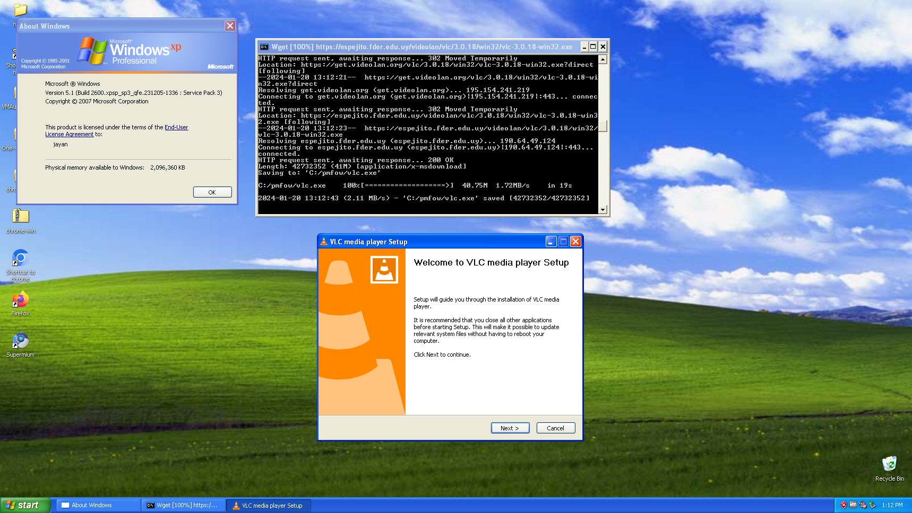

# Package Manager for Old Windows
   

## Idiomas
[English](https://github.com/MasterJayanX/pmfow/blob/main/README.md) | [Español](https://github.com/MasterJayanX/pmfow/blob/main/README_ES.md)
## Descripción
pmfow (Package Manager for Old Windows) es un programa que te permite instalar aplicaciones desde la línea de comandos en versiones antiguas de Windows de manera similar a como lo harías en Linux o en Windows 10 con [winget](https://github.com/microsoft/winget-cli).

<figure>
  
 <figcaption>Captura de pantalla de pmfow instalando Legacy Update en una MV de Windows XP.</figcaption>
</figure>
<figure>
 
 <figcaption>Captura de pantalla de pmfow instalando VLC Media Player en una MV de Windows XP.</figcaption>
</figure>

## Requisitos
### Requisitos de hardware
pmfow funciona en cualquier equipo con Windows 2000 o posterior y tenga una conexión a internet.

**Requisitos mínimos**
- Un procesador
- Algo de RAM
- Almacenamiento (opcional)
- Una conexión a internet (no opcional)

**Requisitos recomendados**
- Un CPU Pentium o Celeron
- 512 MB de RAM (necesarios para ejecutar versiones de Windows más nuevas que XP) o suficiente RAM para usar un navegador web
- Suficiente almacenamiento para almacenar al menos un par de archivos .exe (300 MB de espacio libre deberían ser más que suficientes)
- Una buena conexión a internet (al menos 5 Mbps, pero incluso algo ligeramente mejor que un módem de 56k debería ser suficiente)

### Requisitos de software
pmfow funciona en la mayoría de las versiones de Windows desde Windows 2000 en adelante.

**Esta es la lista de versiones completamente compatibles:**

- Windows XP
- Windows Vista
- Windows 7
- Windows 8
- Windows 8.1

**Esta es la lista de versiones parcialmente compatibles:**

- Windows 10: Windows 10 es parcialmente compatible, ya que la mayoría de los paquetes en el repositorio de Windows 10 son los mismos paquetes que los de Windows 8/8.1. Para Windows 10 y 11, utiliza winget en su lugar.
- Windows 2000: Selección limitada de paquetes disponibles para esta versión de Windows y solo se puede usar con una versión antigua de wget, que puede no funcionar correctamente.
- Versiones de Windows Server desde Server 2003 hasta Server 2022: Solo se detectan las versiones "regulares" de Windows, pero dado que las versiones de Windows Server comparten las mismas versiones de NT que las versiones regulares, deberían funcionar (la única excepción es Server 2003, pero se admite NT 5.2).

## Instalación
Para instalar pmfow, debes seguir estos pasos:
1. Descarga el archivo .exe desde la página de versiones que corresponda a la arquitectura de tu CPU. Si no estás seguro de cuál debes elegir, ve a Panel de control > Sistema y verifica si dice "Sistema operativo de 32 bits" o "Sistema operativo de 64 bits". Si dice 32 bits, elige la versión que dice win32 y si dice 64 bits, elige la versión que dice win64.
2. Abre el archivo .exe y extrae los archivos en una nueva carpeta. Para hacer esto, abre el .exe, haz clic en los tres puntos, crea una nueva carpeta y selecciónala.
3. Después de extraer los archivos, agrega el directorio al Path del sistema. Para hacer esto, ve a Panel de control > Sistema > Avanzado / Configuración avanzada > Variables de entorno. Luego, ve a Variables de entorno del sistema y encuentra donde dice Path. En Windows XP, simplemente haz doble clic donde dice Path, agrega un ; al final de la ventana de texto y pega el directorio completo donde extrajiste los archivos de pmfow (por ejemplo, `C:\pmfow`). En versiones más nuevas de Windows, haz clic en Path, luego haz clic en Editar, haz clic en Nuevo y pega el directorio completo.

## Uso
Para usar pmfow, abre una ventana de CMD y ejecuta el siguiente comando: `pmfow <comando>` (Nota: si no seguiste el paso 3 de la instalación, deberás abrir la ventana de cmd en la misma carpeta donde extrajiste el ejecutable de pmfow y escribir `pmfow.exe <comando>` en su lugar).
Aquí tienes una lista de comandos que puedes usar:
- `pmfow install <paquete>`: Este comando te permitirá instalar el programa que desees. Alternativamente, puedes usar `pmfow i <paquete>`.
- `pmfow update`: Esto actualizará los repositorios, que son simplemente archivos .txt, pero aún así. Alternativamente, puedes usar `pmfow u`.
- `pmfow search <paquete>`: Este comando te permitirá buscar un paquete específico en los repositorios de tu sistema operativo. Alternativamente, puedes usar `pmfow s <paquete>`.
- `pmfow version`: Este comando te mostrará la versión de pmfow que estás ejecutando, así como tu versión de Windows. Alternativamente, puedes usar `pmfow about` o `pmfow v`.
- `pmfow help`: Este comando te mostrará una lista de comandos con una descripción para cada uno, como la que estás viendo aquí. Alternativamente, puedes usar `pmfow h`.
- `pmfow list`: Este comando lista todos los paquetes que se pueden instalar desde tu repositorio. Alternativamente, puedes usar `pmfow l`.

Si usas los comandos install o update, puedes usar estas "flags":
- `-p` o `--powershell`: Fuerza al comando install a utilizar la función DownloadFile de Powershell para descargar los archivos de instalación o actualizar los archivos del repositorio. Para Windows XP y Vista, debes descargar Powershell 2.0 desde [aquí](https://www.catalog.update.microsoft.com/Search.aspx?q=powershell%202.0) para poder usarlo (también deberás instalar .NET 2.0 SP1 desde [aquí](https://www.microsoft.com/en-us/download/details.aspx?id=16614)).
- `-w` o `--wget`: Fuerza al comando install a utilizar wget para descargar los archivos de instalación o actualizar los archivos del repositorio. Esto no es necesario la mayoría de las veces, ya que wget se utiliza por defecto en pmfow.
- `-c` o `--check-certificates`: Le pide a wget que verifique los certificados al descargar un paquete.
- `-f <versión>` o `--force-os <versión>`: Fuerza a pmfow a instalar paquetes para una versión diferente de Windows.
- `--show-url`: Muestra la URL desde la cual se descarga el paquete que estás instalando o buscando.
- `-o` o `--one-file`: El comando update solo actualizará el archivo del repositorio que corresponda a tu versión actual de Windows.
- `--wget-version <versión>`: Fuerza al comando install o update a utilizar una versión de wget para una versión específica de Windows (por ejemplo: Windows XP) en lugar de cambiar el nombre del archivo de la versión que necesitas usar.
- `-u` o `--show-url`: Muestra la URL del paquete.

## Compilación
### Requisitos
- Tener el compilador g++ instalado en un computador con Windows (puedes instalarlo con MinGW).

Para compilar este programa tú mismo, debes descargar los archivos .cpp y guardarlos en el mismo directorio. Alternativamente, puedes descargar los archivos del repositorio usando el siguiente comando en una ventana de terminal: `git clone https://github.com/MasterJayanX/pmfow`. 
Luego, debes abrir una ventana de terminal y compilar el archivo main.cpp con el siguiente comando: `g++ main.cpp -o output.exe` (puedes reemplazar output con el nombre que desees).

## Limitaciones y problemas conocidos
pmfow está en una etapa temprana de desarrollo, por lo que puedes esperar que algunas cosas no funcionen como deberían. Algunas de las limitaciones que tiene en este momento son:
- A diferencia de otros gestores de paquetes, pmfow solo te permitirá instalar un paquete a la vez.
- Los repositorios actualmente tienen una selección muy limitada de software.
- Aún no se admiten la desinstalación de aplicaciones desde pmfow y los instaladores silenciosos.
- pmfow no maneja bien los directorios con espacios, por lo que si estás utilizando Windows XP, no instales pmfow dentro de la carpeta Documents and Settings. En su lugar, podrías extraer los archivos directamente en la unidad C:.

Si encuentras algún problema con pmfow, abre un problema en la sección de Issues y lo revisaré.

## Preguntas frecuentes
### ¿Qué versiones de Windows son compatibles?
Como mencioné anteriormente, pmfow funciona en las siguientes versiones de Windows: Windows 2000, Windows XP, Windows Vista, Windows 7, Windows 8, Windows 8.1, Windows 10, Windows 11 y sus equivalentes para servidores. También debería funcionar en ReactOS y en Linux mediante Wine, pero aún no los he probado.
### ¿Qué son los archivos .txt que vienen junto con los archivos de pmfow?
Esos archivos .txt son simplemente las listas de software que pmfow puede instalar. Básicamente, son como repositorios. Es posible que los cambie a archivos .dat en futuras actualizaciones para evitar confusiones de usuarios nuevos.
### ¿Qué aplicaciones puedo instalar con pmfow?
Puedes encontrar la lista completa de aplicaciones que se pueden instalar en [Software_List.md](https://github.com/MasterJayanX/pmfow/blob/main/Software_List.md) (ten en cuenta que está en inglés).
### ¿Se puede usar pmfow en Windows 9x?
Desafortunadamente, debido a que estas versiones de Windows son demasiado antiguas para que wget funcione de manera confiable en ellas, decidí no agregar soporte para ellas en este proyecto.
### ¿Este proyecto admitirá otros sistemas operativos?
Desafortunadamente no, porque es probable que otros sistemas operativos ya tengan gestores de paquetes para ellos. Por ejemplo, para versiones antiguas de macOS, puedes usar [Tigerbrew](https://github.com/mistydemeo/tigerbrew) y la mayoría de las distribuciones de Linux vienen con un gestor de paquetes.
### ¿Qué cosas planeas agregar?
Estoy planeando agregar la opción de instalar varios paquetes a la vez, más flags para configurar la forma en que se instalan los paquetes o se actualizan los repositorios, la opción de usar instaladores silenciosos y, por supuesto, seguiré agregando más aplicaciones a los repositorios.

## Donaciones
Acepto donaciones a través de Ko-fi:

